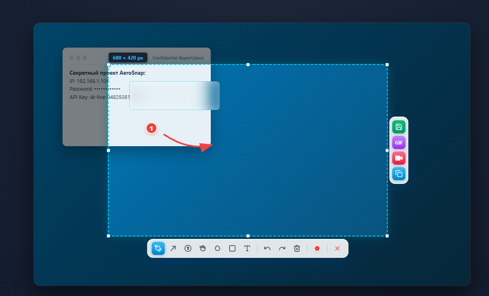
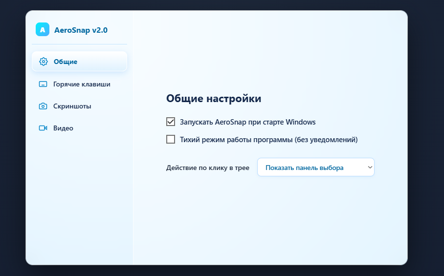

# AeroSnap — скриншотер фото и видео

AeroSnap — лёгкое приложение для создания скриншотов и записи экрана на Windows в стиле Frutiger Aero, вдохновлённое skrinshoter.ru.



## Возможности

- ✂️ **Захват выбранной области экрана:** моментальное выделение с точными размерами пикселей.
- 🎨 **Аннотации и рисование:** карандаш, стрелки, нумерация шагов (1, 2, 3...), прямоугольники и текст.
- 💧 **Мягкое Gaussian-размытие:** скрытие конфиденциальных данных кистью (рукой) или прямоугольной областью (клякса).
- ↩️ **История действий:** отмена (Undo) и повтор (Redo) любых изменений, быстрая очистка.
- 💾 **Умное сохранение:** системный диалог «Сохранить как» для PNG/JPG с автоматическим открытием папки.
- 📋 **Буфер обмена:** автоматическое копирование готового снимка или видео.
- 📹 **Запись экрана:** мгновенный захват видео в формате MP4 или GIF-анимаций.
- ⚙️ **Трей и горячие клавиши:** тихий запуск в трей, автозагрузка Windows, настраиваемые горячие клавиши.



## Сборка

Требуются Rust, Windows WebView2 и Node.js с установленным Tauri CLI.

```powershell
npm install
npm run tauri:build
```

## Публикация и релизы

Готовый установщик доступен в разделе [Releases](https://github.com/Eniggman/AeroSnap/releases).  
Контрольная сумма установщика — в `release/SHA256SUMS.txt`, изменения — в `release/CHANGES_2.0.md`.

Проект не содержит пользовательских скриншотов, профилей, секретов или абсолютных путей разработки.

## Лицензия

MIT.

